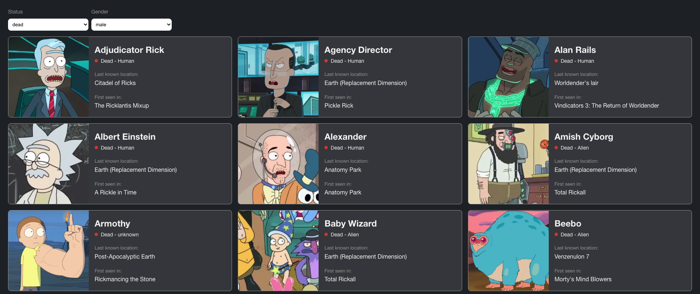

# Rick & Morty

## Screenshot


## Technologies
* [Axios](https://axios-http.com/)
* [Vitest](https://vitest.dev/)
* [Vue 3](https://vuejs.org/)
* [Vue router](https://router.vuejs.org/)
* [Vue Test Utils](https://test-utils.vuejs.org/)

## Resources
[Rick and Morty API](https://rickandmortyapi.com/documentation/#rest)

## Project Setup

```sh
npm install
```

### Compile and Hot-Reload for Development

```sh
npm run dev
```
